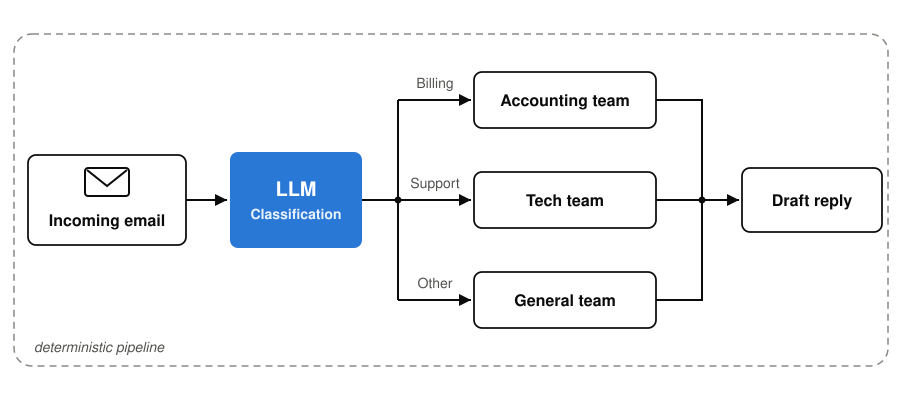

# A concrete example: email triage

**Only the blue node is the AI model — everything else is ordinary software and *tools it can call***

<!-- Notes:
Adapted from the overview deck's email-triage slide (source: workshop-agentic-workflows/01, slides_en 07). Two minutes. This is the mental model participants will imitate in the exercise, so make it concrete.
Walk the diagram: incoming customer email → the model classifies it (complaint? order status? technical question?) → depending on the class it looks something up (order database, FAQ documents) → drafts a reply → a human approves and sends. The model decides which tool to consult; the send stays behind a human click — remember that detail, it returns in the security section as "human in the loop".
Name two more examples verbally so different industries see themselves: (1) a meeting-prep assistant that pulls the attendee list from the calendar, recent correspondence from the CRM, and drafts a briefing; (2) an invoice-intake workflow that reads incoming PDFs, matches them against orders, and flags mismatches.
Good priming question for the exercise, ask it now and let it hang: "Which recurring task in your company involves looking things up in 2-3 systems and then producing a draft?" That is the sweet spot.
Transition: for any of this the model must reach YOUR systems — mailbox, order database, FAQ store. How? That connector is MCP.
-->
