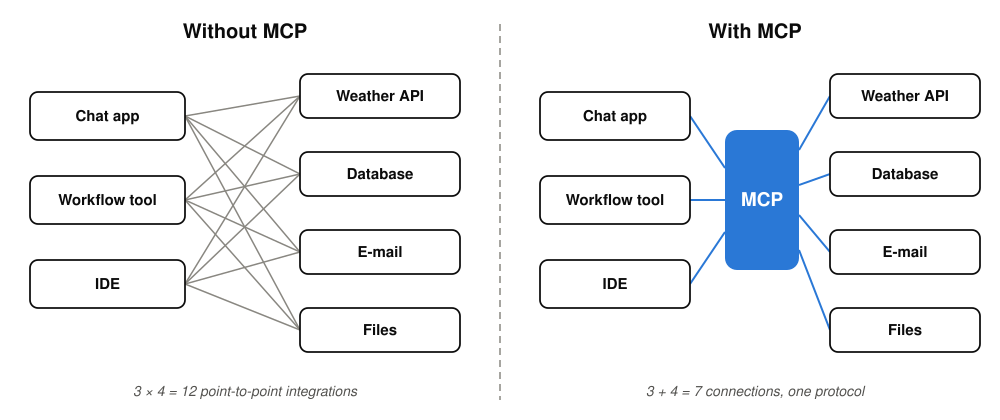

# The problem: every app &times; every tool

*2023/24 in practice: ChatGPT plugins · LangChain tools · per-IDE extensions · hand-rolled glue, none of them compatible*

**N apps &times; M tools = N &times; M custom integrations. With one shared protocol: N + M.**

<!-- Notes:
Taken nearly as-is from the MCP deck (source: workshop-agentic-workflows/02, slide 01). Two minutes.
Make it concrete before the diagram: the email-triage assistant from the last slide needs three things — the mailbox, the order database, and the FAQ documents. Every app that should use them (a chat UI, a workflow tool, tomorrow something else) needs its own connector to each: 3 x 3 = 9 integrations, each built, maintained, and broken separately. Add a fourth tool, write three more connectors. This is what teams actually did in 2023/24: every product had its own plugin format, none compatible.
MCP in one sentence: an open protocol that standardizes how LLM applications connect to tools and data sources. Released and open-sourced by Anthropic in November 2024. Within a year it became the industry default: OpenAI adopted it in March 2025, Google announced Gemini support in April 2025, Microsoft built it into Copilot Studio and Windows (Build 2025).
The business takeaway to say out loud: because it is ONE standard, tools built for it work everywhere — which is why thousands of ready-made servers exist that you can use instead of building. That ecosystem is what the exercise taps into.
-->
