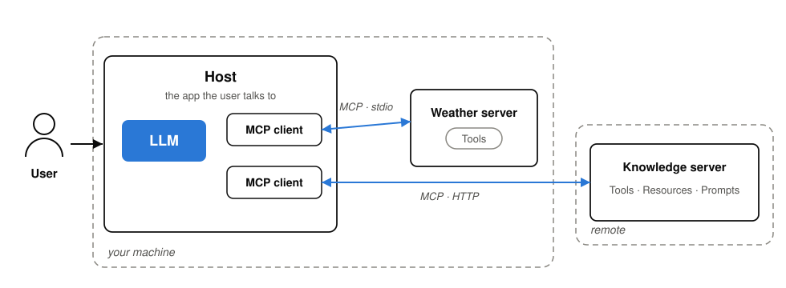

# How MCP works

- A **server** offers up to three things: **Tools** (functions the model can call) · **Resources** (data for context) · **Prompts** (reusable templates)
- Two transports: **stdio** (local — the server runs on your machine) · **HTTP** (remote — you connect to the provider's server)

<!-- Notes:
Taken nearly as-is from the MCP deck (source: workshop-agentic-workflows/02, slide 02). Two minutes. The vocabulary on this slide is deliberately kept: participants meet exactly these words (stdio, HTTP/remote, tools) on server directory pages ten minutes from now.
Keep the roles minimal: the HOST is the app the user talks to (a chat app, a workflow tool like Langflow). It runs one MCP CLIENT per connection. A SERVER is a small program that announces what it offers. On connect there is a handshake, then the client asks "what do you have?", and the tool names and descriptions are handed to the model.
The three primitives with one example each: Tools dominate in practice (easily 90% of real-world usage): get_weather(city), query_database(...), create_ticket(...). Resources are data the app can pull into context (a server exposing your FAQ files). Prompts are templates the user picks from a menu. Don't drill deeper; tools carry everything today.
Transports — and this matters for the security part, say it clearly: stdio means the host STARTS the server as a local program on your machine. Nothing leaves your machine, but you are running someone's code with your user's rights. HTTP/remote means you connect to a server the provider operates: no foreign code on your machine, but your data travels to them. Neither is "the safe one" — they fail differently, and the vetting checklist asks about exactly this.
Only if a technical person asks about the wire format: it is JSON-RPC, runtime discovery via tools/list — full backup slide at the end of the deck.
-->
