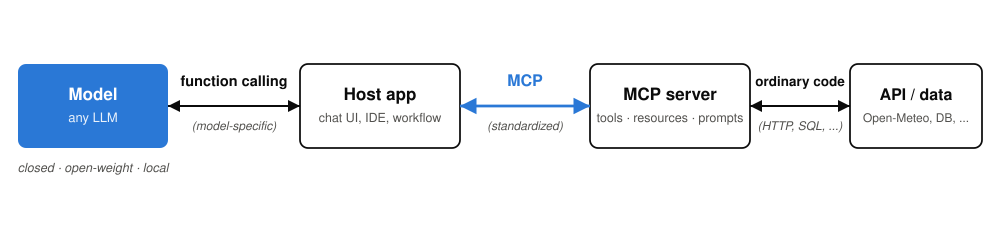

<!-- _paginate: false -->

# Backup · "Isn't this just another API?"

| | A classic API *(REST, gRPC, ...)* | MCP |
|---|---|---|
| **Contract** | one per service, each different | **one fixed interface** for every tool |
| **Integration** | design time: read docs, write glue code | **runtime**: `tools/list` → model context |
| **Consumer** | a developer | **the model**, reading descriptions |

**Underneath: JSON-RPC, the LSP/ODBC trick · the model still does plain function calling → any model works**

<!-- Notes:
Backup slide for the most common technical question. Adapted from workshop-agentic-workflows/02, slide 04.
To the skeptic: yes, underneath it is RPC. The new part is not the mechanics, it is the economics: ONE standardized API for discovering and calling all the others. Every REST API is a different contract a developer integrates at design time. MCP is the same dozen methods for every capability, integrated at runtime: the client asks, the answer goes into the model's context, done. The win is discovery and uniformity, not new capability.
The pattern has precedents: LSP solved editors x languages with the same move (MCP is explicitly inspired by it), ODBC solved apps x databases. SOAP/WSDL promised discoverable services twenty years ago and failed partly because no consumer could USE an interface it had never seen — an LLM is exactly that consumer, which is why discovery finally works.
The layer picture resolves "does model X support MCP?": HOSTS support MCP, models do not. The model sees plain tool definitions in whatever function-calling format it natively speaks; the host translates. And a normal MCP server WRAPS an existing API (a weather API, SQL, REST): MCP does not replace your existing services, it fronts them with a uniform plug — the standard migration path.
Practical consequence: swap the model without touching tool integrations, swap tools without touching the model. A fully open, self-hosted stack (open-weight model + open host + your own servers) is a first-class citizen.
-->
