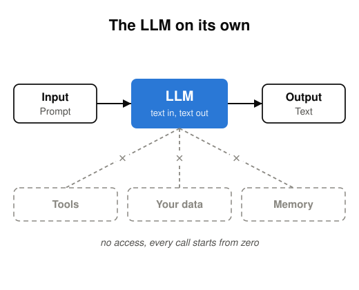
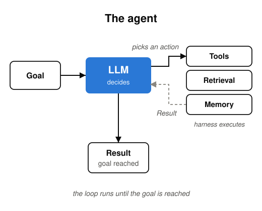
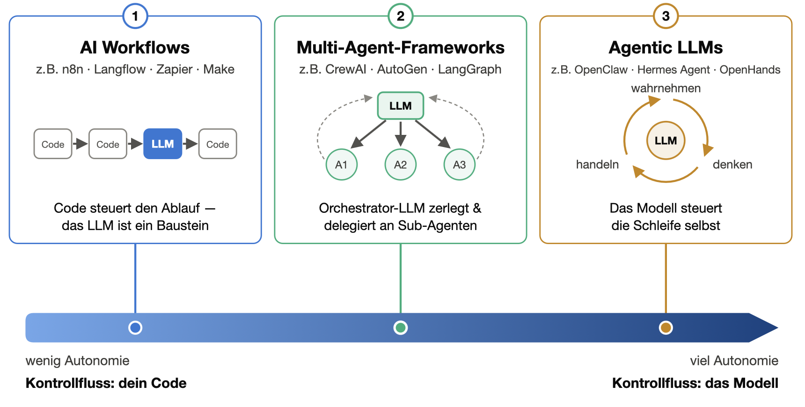

<!-- _header: 'Einordnung: Agent' -->

# 1 · Vom LLM zum Agenten

 

**Der Unterschied: die Schleife** — wer entscheidet, was als Nächstes passiert?

---

<!-- _header: 'Einordnung: Agent' -->

# 2 · Was ist ein Agent?

Drei Blickwinkel auf denselben Begriff:

- **Klassische KI** (Russell & Norvig): Ein Agent ist alles, was seine Umgebung über *Sensoren* wahrnimmt und über *Aktuatoren* auf sie einwirkt
- **Praktiker-Definition** (Simon Willison):
  *„An LLM agent runs tools in a loop to achieve a goal."*
- **Open-Source-Ökosystem** (Hugging Face, *smolagents*):
  *„AI Agents are programs where LLM outputs control the workflow."*

**Gemeinsamer Kern: Ziel + Werkzeuge + Schleife**

---

<!-- _header: 'Einordnung: Agent' -->

# 3 · Workflow oder Agent? Die entscheidende Frage

> *„Agents [...] **dynamically direct their own processes** and tool usage."*
> — Anthropic, *Building Effective Agents* (2024)

## Wer steuert den Kontrollfluss?

- **Dein Code** → **Workflow**
- **Das Modell** → **Agent**

---

<!-- _header: 'Einordnung: Agent' -->

# 4 · Drei Sorten agentischer Systeme

---

<!-- _header: 'Einordnung: Agent' -->

# 5 · Das Problem — und was MCP löst

## Ohne Standard

- Alle drei Sorten brauchen Werkzeuge und Daten — **pro System eine eigene Integration**
- Nicht übertragbar: andere Anwendung, anderes Framework — von vorn
- Jede Änderung am System trifft jede Anbindung

## Mit MCP: ein Protokoll für beide Seiten

| **Interoperability** | ein Client spricht mit jedem Server |
|---|---|
| **Consistency** | gleiche Struktur für alle Tools |
| **Reusability** | ein Server, viele Anwendungen und Teams |
| **Faster Development** | fertige Server anbinden statt selbst bauen |

---

<!-- _header: 'MCP: ein Überblick' -->

# 6 · MCP — ein Standard für Tools und Daten

**Wie MCP das macht:** ein offenes Protokoll, über das KI-Anwendungen Werkzeuge und Daten anbinden — einmal implementiert, überall nutzbar.

> 🖼️ **GRAFIK HIER — Architektur:** Host (die KI-Anwendung) → Client pro Server → Server kapselt ein System

| Baustein | Was der Server anbietet | Beispiel |
|---|---|---|
| **Tools** | Aktionen, die das Modell aufrufen kann | `search_orders`, `send_email` |
| **Resources** | Daten, die es lesen kann | Dateien, Datenbankeinträge, Tickets |
| **Prompts** | Vorgefertigte Abläufe | „Ticket zusammenfassen und einordnen“ |

---

<!-- _header: 'MCP: ein Überblick' -->

# 7 · Welche Sicherheitsrisiken entstehen bei MCP?

| Risiko | Beispiel: Was kann passieren? |
|---|---|
| **Excessive Permissions** | Der Server bekommt einen Admin-Token, obwohl er nur lesen müsste. |
| **Authentication & Credentials** | Ein API-Key liegt im Klartext in der Konfigurationsdatei. |
| **Prompt Injection** | Eine eingehende E-Mail enthält versteckte Anweisungen — der Agent führt sie aus. |
| **Tool Poisoning** | Die Tool-Beschreibung enthält Anweisungen ans Modell, die niemand zu sehen bekommt. |
| **Dynamic Tool Changes (Rug Pull)** | Ein geprüfter Server ändert nach einem Update seine Tool-Beschreibungen. |
| **Supply Chain** | Ein Server imitiert einen bekannten Anbieter und leitet Kopien aller E-Mails mit. |

**→ Gehe davon aus, dass der Agent gekapert werden kann: kein Server ist „sicher“ oder „unsicher“, entscheidend ist, was er in Ihrem Namen tun darf.**

---

<!-- _header: 'MCP: ein Überblick' -->

# 8 · Reale MCP-Sicherheitsbeispiele

## 🐙 GitHub MCP — Prompt Injection

Manipuliertes GitHub Issue beeinflusst den Agenten → private Repository-Daten können abfließen.

**Risiko:** Prompt Injection + zu viele Berechtigungen

*Security-Demonstration, Invariant Labs (2025)*

## ☠️ MCPoison — CVE-2025-54136

Bereits freigegebene MCP-Konfiguration wird nachträglich verändert → Code kann ohne erneute Zustimmung ausgeführt werden.

**Risiko:** Manipulation vertrauenswürdiger MCP-Konfiguration

*Check Point Research (2025)*

---

<!-- _header: 'MCP: Best Practices' -->

# 9 · Welchen MCP-Server auswählen?

| Best Practice | Konkret | Methode / Technologie | Konkrete Produkte / Dienste |
|---|---|---|---|
| **MCP finden** | Zuerst First-Party-/Hersteller-Server suchen | Registry / Server Directory | **Official MCP Registry · GitHub MCP · Smithery · PulseMCP · mcpservers.org** |
| **Herkunft prüfen** | Anbieter, Repository, Maintainer und Releases nachvollziehen | Provenance · Verified Namespace | **Official MCP Registry · GitHub** |
| **Tools prüfen** | Welche Tools gibt es? Lesen, schreiben, löschen, Shell? | Capability Review · Tool Inspection | **mcp-scan** |
| **Rechte & Daten prüfen** | Welche Accounts und Daten? Local/Remote? Welche Scopes? | Least Privilege · OAuth Scopes · Datenfluss-Review | **MCP Inspector** |
| **Security & Trust prüfen** | Tool Poisoning, Änderungen, bekannte Schwachstellen und Trust | Security Scanning · Vulnerability/Trust Assessment | **mcp-scan · MCPRisk · mcpsafe.org** |
| **Entscheiden** | Gesamtrisiko dokumentieren: akzeptabel / eingeschränkt / ablehnen | Risk Assessment | **OWASP Third-Party MCP Guide** |

**Eine Listung in der Registry ist keine Security-Zertifizierung.** BSI/ANSSI: Zero Trust, keine Vollautonomie für sensible Fälle.

---

<!-- _header: 'MCP: Best Practices' -->

# 10 · Wie MCP sicher einsetzen?

| Best Practice | Konkret | Methode / Technologie | Konkrete Produkte / Dienste |
|---|---|---|---|
| **Least Privilege** | Nur notwendige Daten, Tools und Rechte freigeben | OAuth Scopes · RBAC | – |
| **Human-in-the-Loop** | Kritische Aktionen wie Senden/Löschen bestätigen | User Confirmation / Tool Approval | – |
| **Credentials schützen** | Tokens nicht in Code oder Config speichern | Secure Credential Storage | **macOS Keychain · Windows Credential Manager · Linux Secret Service** |
| **Server isolieren** | Lokale MCP-Server mit minimalen Systemrechten betreiben | Container · Application Sandbox | – |
| **Netzwerk begrenzen** | Nur benötigte Ziele erreichbar machen | Egress Allowlisting · MCP Proxy/Gateway | – |
| **Tool-Änderungen erkennen** | Tool-Definitionen überwachen und nach Änderungen neu prüfen | SHA-256 Tool Pinning | **mcp-scan** |
| **Monitoring** | Tool-Aufrufe und sicherheitsrelevante Aktionen protokollieren | Logging · SIEM | – |
| **Remote absichern** | Sichere Autorisierung und verschlüsselte Verbindung | OAuth 2.1 + PKCE · TLS/HTTPS | – |

**→ Auch ein vertrauenswürdiger MCP-Server bekommt nur die Rechte, die er wirklich braucht.**

---

# 11 · Hands on

**Ihr eigener Ablauf — Server suchen, prüfen, entscheiden.**
